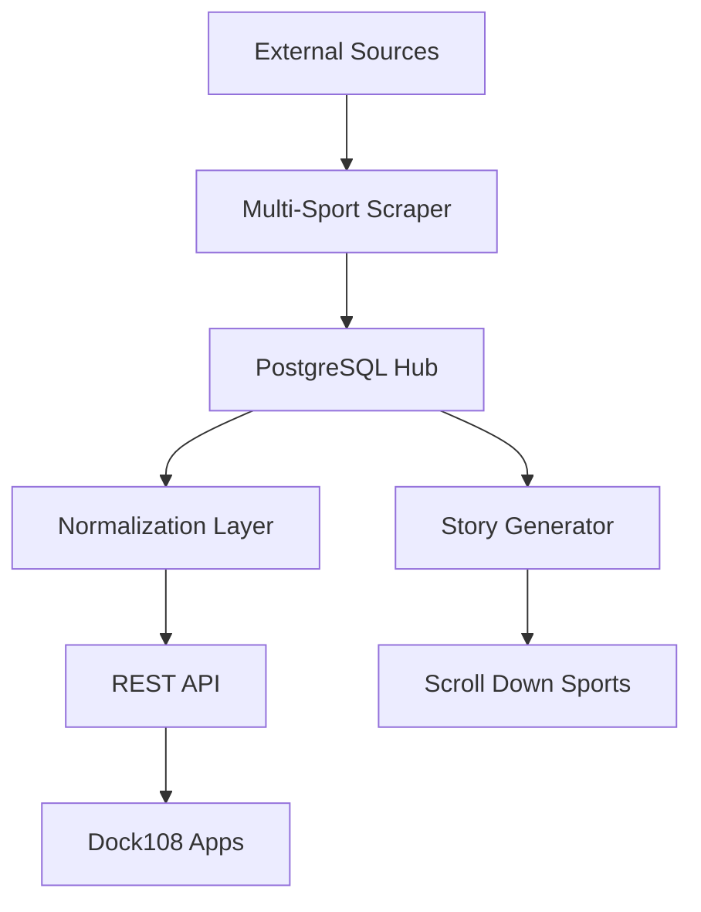

# Sports Data Admin

**Centralized sports data hub for all Dock108 apps.**

Automated ingestion, normalization, and serving of sports data from multiple sources. Provides:
- Multi-sport play-by-play, box scores, odds, and social media
- Narrative story generation (Scroll Down Sports)
- Unified API for all Dock108 sports products
- Admin UI for data management and monitoring

## What This System Does

**Data Ingestion:**
- Automated scraping from ESPN, Hockey Reference, Sports Reference
- Multi-sport support: NBA, NHL, NCAAB
- Play-by-play, box scores, odds, social media
- Scheduled and on-demand runs

**Data Serving:**
- RESTful API for all Dock108 apps
- Normalized schemas across sports
- Real-time and historical data
- Admin endpoints for management

**Story Generation (Scroll Down Sports):**
- Chapters-first narrative system
- AI-powered summaries and recaps
- Deterministic structural segmentation
- Admin UI for inspection and debugging

## Architecture



## Tech Stack

- **API:** Python, FastAPI, PostgreSQL
- **Scraper:** Python, uv, Celery
- **Admin UI:** React, TypeScript, Next.js
- **Infrastructure:** Docker, Caddy, Redis

## Run Locally

```bash
cd infra
cp .env.example .env

docker compose --profile dev up -d --build
```

Note: `infra/.env` contains secrets and is gitignored.

**URLs:**
- Admin UI: http://localhost:3000
- API Docs: http://localhost:8000/docs
- Health: http://localhost:8000/healthz

For manual setup, see [docs/LOCAL_DEVELOPMENT.md](docs/LOCAL_DEVELOPMENT.md).

## Key Features

**Centralized Data Hub:**
- Single source of truth for all Dock108 sports products
- Automated ingestion from multiple sources
- Normalized schemas across NBA, NHL, NCAAB
- Real-time and historical data access

**Data Types:**
- Play-by-play (full game timelines)
- Box scores (team and player stats)
- Betting odds (multiple books)
- Social media (team highlights and reactions)

**Story Generation (Scroll Down Sports):**
- Chapters-first narrative system
- Deterministic structural segmentation
- AI-powered summaries and recaps
- Admin UI for inspection and debugging

**Admin Tools:**
- Data browser and search
- Scraper run management
- Story generator interface
- Data quality monitoring

## Documentation

**Getting Started:**
- [Architecture Overview](docs/ARCHITECTURE.md)
- [Local Development](docs/LOCAL_DEVELOPMENT.md)
- [API Reference](docs/API.md)

**Story Generation:**
- [Book + Chapters Model](docs/BOOK_CHAPTERS_MODEL.md)
- [NBA v1 Boundary Rules](docs/NBA_V1_BOUNDARY_RULES.md)
- [AI Context Policy](docs/AI_CONTEXT_POLICY.md)
- [Admin UI Guide](docs/ADMIN_UI_STORY_GENERATOR.md)

**Full Index:** [docs/INDEX.md](docs/INDEX.md)

## Deployment

Infrastructure details: [docs/INFRA.md](docs/INFRA.md)  
Deployment guide: [docs/DEPLOYMENT.md](docs/DEPLOYMENT.md)

## Contributing

See [AGENTS.md](AGENTS.md) for coding standards and principles.
