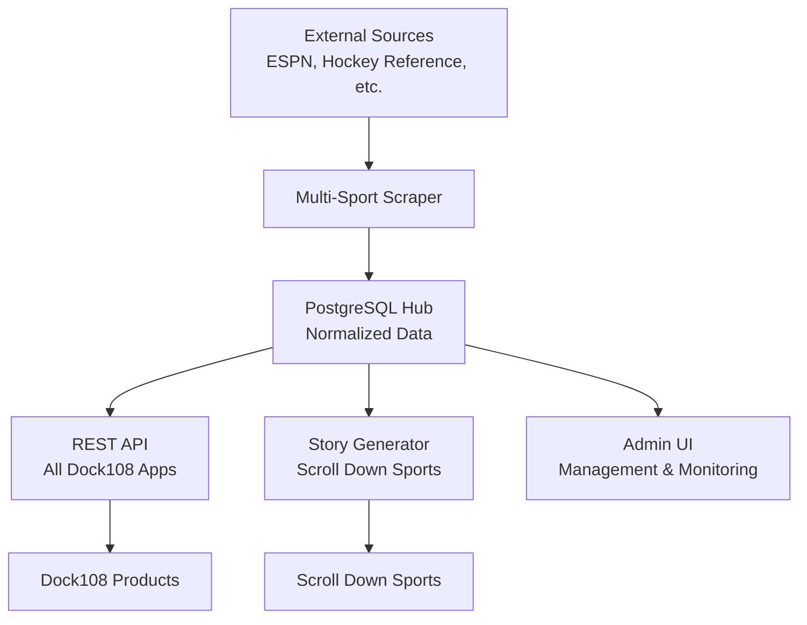
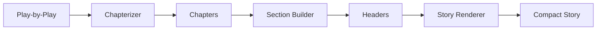

# Architecture Overview

## System Purpose

Sports Data Admin is the **centralized sports data hub for all Dock108 apps**.

**Primary Functions:**
- Automated ingestion from multiple sports data sources
- Normalization and storage in unified PostgreSQL database
- REST API serving data to all Dock108 sports products
- Narrative story generation (Scroll Down Sports feature)
- Admin UI for data management and monitoring

**Scope:** Multi-sport (NBA, NHL, NCAAB), multi-consumer (all Dock108 apps)

## High-Level Architecture



## Components

### 1. Data Scraper (`scraper/`)
**Purpose:** Automated ingestion from external sources

- **Sports:** NBA, NHL, NCAAB
- **Sources:** ESPN, Hockey Reference, Sports Reference
- **Data Types:** Play-by-play, box scores, odds, social media
- **Scheduling:** Celery task queue
- **Output:** Normalized data to PostgreSQL

### 2. REST API (`api/`)
**Purpose:** Serve data to all Dock108 apps

- **Framework:** FastAPI
- **Database:** PostgreSQL (async SQLAlchemy)
- **Endpoints:** Games, plays, box scores, odds, social, teams
- **Story API:** Chapters-first narrative generation (Scroll Down feature)
- **Admin Endpoints:** Scraper management, data browser

### 3. Admin UI (`web/`)
**Purpose:** Data management and monitoring

- **Framework:** React + TypeScript + Next.js
- **Features:**
  - Data browser (games, plays, stats)
  - Story Generator interface (Scroll Down feature)
  - Scraper run management
  - Data quality monitoring

### 4. Database (PostgreSQL)
**Purpose:** Single source of truth

- **Schema:** Normalized across sports
- **Tables:** games, plays, box scores, odds, social posts, teams
- **Migrations:** Alembic (see `sql/`)
- **Access:** Async SQLAlchemy ORM

---

## Story Generation Pipeline

The core product feature: converting play-by-play into narrative stories.

### Pipeline Flow



### Stage Details

#### 1. Chapterizer
**Input:** Normalized play-by-play events
**Output:** Chapters with reason codes
**Logic:** Structural boundary detection (NBA rules)
**Deterministic:** Yes
**AI:** No

**Boundaries:**
- Hard: Period start/end, overtime, game end
- Scene Reset: Timeouts, reviews, challenges
- Momentum: Crunch time start

See [NBA_BOUNDARY_RULES.md](NBA_BOUNDARY_RULES.md)

#### 2. Section Builder
**Input:** Chapters
**Output:** StorySections with beat types, stats, notes
**Logic:** Transforms chapters into AI-ready input
**Deterministic:** Yes
**AI:** No

**Provides:**
- Beat type classification (RUN, RESPONSE, STALL, etc.)
- Team and player stat deltas
- Machine-generated observations
- Time context (period, clock)

#### 3. Header Generator
**Input:** StorySections
**Output:** Deterministic one-sentence headers
**Logic:** Template-based selection by beat type
**Deterministic:** Yes
**AI:** No

Headers are orientation anchors (WHERE we are), not narrative.

#### 4. Story Renderer (Single AI Call)
**Input:** Sections + Headers + Team info
**Output:** Compact story (prose narrative)
**Logic:** Render outline into cohesive prose
**AI:** Yes (OpenAI)

**AI's Role:**
- Turn outline into prose
- Use headers verbatim
- Follow prompt rules for tone, shape, flow
- Add language polish WITHOUT adding logic

See [SUMMARY_GENERATION.md](SUMMARY_GENERATION.md)

#### 5. GameStory Output
**Format:** JSON
**Contains:** Sections, headers, compact story
**Consumed By:** Admin UI, consumer apps  

---

## Data Models

### Play
```python
@dataclass
class Play:
    index: int              # Position in timeline (0-based)
    event_type: str         # "pbp", "social", etc.
    raw_data: dict          # Complete event data
```

**Properties:**
- Atomic unit of game action
- Immutable
- Chronological

### Chapter
```python
@dataclass
class Chapter:
    chapter_id: str         # "ch_001"
    play_start_idx: int     # First play (inclusive)
    play_end_idx: int       # Last play (inclusive)
    plays: list[Play]       # Raw plays in chapter
    reason_codes: list[str] # Why boundary exists
    period: int | None      # Quarter/period
    time_range: TimeRange | None  # Clock range
```

**Properties:**
- Contiguous play range
- Deterministic boundaries
- No inherent narrative text

### StorySection
```python
@dataclass
class StorySection:
    section_index: int
    beat_type: BeatType
    team_stat_deltas: dict[str, TeamStatDelta]
    player_stat_deltas: dict[str, PlayerStatDelta]
    notes: list[str]
    start_score: dict[str, int]
    end_score: dict[str, int]
    start_period: int | None
    end_period: int | None
    start_time_remaining: int | None
    end_time_remaining: int | None
```

**Properties:**
- AI-ready representation of chapters
- Contains beat type classification
- Includes stat deltas and machine-generated notes
- Time context for reader-facing anchoring

### GameStory
```python
@dataclass
class GameStory:
    game_id: int
    sport: str
    chapters: list[Chapter]
    compact_story: str | None
    reading_time_estimate_minutes: float | None
    metadata: dict
```

**Properties:**
- Authoritative output
- Consumed by apps
- Forward-compatible schema

---

## AI Responsibility Boundaries

### What AI Does
- ✅ Render sections into prose (single call)
- ✅ Use headers verbatim
- ✅ Follow prompt rules for tone, shape, flow
- ✅ Add language polish
- ✅ Match target word count

### What AI Does NOT Do
- ❌ Define chapter/section boundaries
- ❌ Decide structure or importance
- ❌ Infer stats beyond provided signals
- ❌ Plan or restructure the outline
- ❌ Invent context or drama
- ❌ Generate separate chapter summaries/titles

**Principle:** Code decides structure. AI renders it into prose.

---

## Database Schema

### Core Tables
- `sports_games` - Game metadata
- `sports_game_plays` - Play-by-play events
- `sports_team_boxscores` - Team stats
- `sports_player_boxscores` - Player stats
- `sports_game_odds` - Betting lines
- `game_social_posts` - Social media content

### Story Tables (Future)
- `game_stories` - Generated stories (planned)
- `chapter_summaries` - Chapter summaries (planned)

See `sql/` for complete schema.

---

## API Endpoints

### Story Generation
- `GET /api/admin/sports/games/{id}/story` - Fetch game story
- `GET /api/admin/sports/games/{id}/story-state` - Fetch story state
- `POST /api/admin/sports/games/{id}/story/regenerate-*` - Regenerate components

### Game Data
- `GET /api/admin/sports/games` - List games
- `GET /api/admin/sports/games/{id}` - Game details
- `GET /api/admin/sports/games/{id}/plays` - Play-by-play

### Scraper
- `GET /api/admin/sports/scrape-runs` - List scraper runs
- `POST /api/admin/sports/scrape-runs` - Start scraper

See [API.md](API.md) for complete reference.

---

## Tech Stack Details

### Backend
- **Framework:** FastAPI
- **Database:** PostgreSQL 15+
- **ORM:** SQLAlchemy (async)
- **Migrations:** Alembic
- **AI:** OpenAI API
- **Task Queue:** Celery + Redis

### Frontend
- **Framework:** Next.js 14
- **Language:** TypeScript
- **Styling:** CSS Modules
- **API Client:** Fetch API

### Scraper
- **Language:** Python 3.11+
- **Package Manager:** uv
- **HTTP:** httpx
- **Parsing:** BeautifulSoup, lxml

---

## Development Workflow

### Local Development
```bash
# Backend
cd api
pip install -r requirements.txt
uvicorn main:app --reload

# Frontend
cd web
npm install
npm run dev

# Scraper
cd scraper
uv sync
uv run python -m sports_scraper
```

### Running Tests
```bash
# Backend
cd api
pytest

# Frontend
cd web
npm test
```

### Database Migrations
```bash
cd api
alembic upgrade head
```

---

## Deployment

**Environments:**
- Development (local)
- Staging (staging.scrolldownsports.com)
- Production (api.scrolldownsports.com)

**Infrastructure:**
- Docker containers
- Caddy reverse proxy
- PostgreSQL managed database
- Redis for Celery

See [DEPLOYMENT.md](DEPLOYMENT.md) and [INFRA.md](INFRA.md).

---

## Key Principles

1. **Stability over speed** — Downstream apps depend on this
2. **Predictable schemas** — No silent changes
3. **Zero silent failures** — Log everything
4. **Traceable changes** — Every transformation explainable
5. **Structure before narrative** — Chapters are deterministic
6. **No future knowledge** — AI sees only prior chapters

See [CLAUDE.md](../CLAUDE.md) for coding standards.
