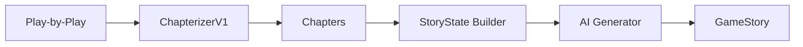

# Book + Chapters Model

**Status:** Authoritative  
**Date:** 2026-01-21  
**Scope:** NBA v1

---

## Overview

The Book + Chapters model is the core architecture for narrative story generation.

**Core Principle:** A game is a book. Plays are pages. Chapters are contiguous play ranges that represent coherent scenes.

**Design Philosophy:**
- **Structure before narrative** — Chapters are deterministic
- **Separation of concerns** — Structure, context, and narrative are distinct layers
- **No future knowledge** — AI sees only prior chapters during generation

---

## Core Definitions

### Play

**The atomic unit of game action.**

A play is a single play-by-play event. Plays are the raw pages of the game's book.

```python
@dataclass
class Play:
    index: int              # Position in timeline (0-based)
    event_type: str         # Type of event (pbp, social, etc.)
    raw_data: dict[str, Any]  # Complete event data
```

**Properties:**
- Chronological
- Immutable
- Complete (contains all original data)

---

### Chapter

**A contiguous range of plays representing a single narrative scene.**

Chapters are the structural unit for storytelling and UI expansion.

```python
@dataclass
class Chapter:
    chapter_id: str         # Unique ID (e.g., "ch_001")
    play_start_idx: int     # First play index (inclusive)
    play_end_idx: int       # Last play index (inclusive)
    plays: list[Play]       # Raw plays in chapter
    reason_codes: list[str] # Why this boundary exists
    period: int | None      # Quarter/period number
    time_range: TimeRange | None  # Game clock range
```

**Properties:**
- Contiguous (no gaps)
- Deterministic (same input → same output)
- Structural (not narrative)
- Explainable (reason codes)

**What Chapters Are:**
- Logistics for storytelling
- UI expansion units
- Structural scene breaks

**What Chapters Are NOT:**
- Narrative labels
- Importance rankings
- Event buckets

---

### StoryState

**Running context derived from prior chapters only.**

StoryState is the only shared memory the AI is allowed to have.

```python
@dataclass
class StoryState:
    chapter_index_last_processed: int
    players: dict[str, PlayerStoryState]
    teams: dict[str, TeamStoryState]
    momentum_hint: MomentumHint
    theme_tags: list[str]
    constraints: dict  # no_future_knowledge: true
```

**Properties:**
- Derived deterministically
- Updated incrementally
- Bounded (top 6 players, max 8 themes)
- No future knowledge

**Enables:**
- Natural callbacks ("he already had 20 through three")
- Thematic continuity
- Context-aware narration

---

### GameStory

**The authoritative output consumed by apps.**

```python
@dataclass
class GameStory:
    game_id: int
    sport: str
    chapters: list[Chapter]
    compact_story: str | None
    reading_time_estimate_minutes: float | None
    metadata: dict
```

**Properties:**
- Complete game narrative
- Forward-compatible schema
- Serializable as JSON

**Contains:**
- All chapters (structural units)
- Chapter summaries (AI-generated)
- Chapter titles (AI-generated)
- Compact story (AI-generated full recap)

---

## Pipeline Architecture

### High-Level Flow



### Stage 1: Chapterization

**Component:** `ChapterizerV1`  
**Input:** Normalized play-by-play events  
**Output:** Chapters with reason codes  
**Deterministic:** Yes  
**AI:** No  

**Logic:**
- Detect structural boundaries (NBA v1 rules)
- Create contiguous chapters
- Assign reason codes
- Validate coverage

**Boundaries:**
- **Hard:** Period start/end, overtime, game end
- **Scene Reset:** Timeouts, reviews, challenges
- **Momentum:** Crunch time start (minimal v1)

See [NBA_V1_BOUNDARY_RULES.md](NBA_V1_BOUNDARY_RULES.md)

### Stage 2: Story State Building

**Component:** `build_state_incrementally()`  
**Input:** Ordered chapters  
**Output:** StoryState after each chapter  
**Deterministic:** Yes  
**AI:** No  

**Logic:**
- Extract player stats from play text
- Track notable actions (dunk, block, steal, etc.)
- Determine momentum hints from reason codes
- Assign theme tags deterministically
- Enforce bounded lists

See [AI_CONTEXT_POLICY.md](AI_CONTEXT_POLICY.md)

### Stage 3: AI Story Generation

**Component:** `generate_chapter_summary()`, `generate_chapter_title()`, `generate_compact_story()`  
**Input:** Current chapter + StoryState  
**Output:** Summaries, titles, compact story  
**Deterministic:** No (AI)  
**AI:** Yes (OpenAI)  

**Modes:**

#### A. Chapter Summary (Sequential)
- Input: Prior summaries + StoryState + current chapter
- Output: 1-3 sentence summary
- Context: Prior chapters only
- Spoilers: Forbidden (except final chapter)

#### B. Chapter Title (Sequential)
- Input: Chapter summary
- Output: 3-8 word title
- Context: Summary only
- Spoilers: Forbidden

#### C. Compact Story (Full Arc)
- Input: All chapter summaries
- Output: Full game recap (4-12 min read)
- Context: Complete narrative arc
- Spoilers: Allowed (post-game)

See [AI_SIGNALS_NBA_V1.md](AI_SIGNALS_NBA_V1.md)

---

## Data Flow

### Input: Play-by-Play
```json
[
  {
    "play_index": 0,
    "quarter": 1,
    "game_clock": "12:00",
    "description": "Jump ball",
    "team": "LAL",
    "score_home": 0,
    "score_away": 0
  },
  ...
]
```

### Output: GameStory
```json
{
  "game_id": 1,
  "sport": "NBA",
  "story_version": "1.0.0",
  "chapters": [
    {
      "chapter_id": "ch_001",
      "index": 0,
      "play_start_idx": 0,
      "play_end_idx": 15,
      "play_count": 16,
      "reason_codes": ["PERIOD_START"],
      "period": 1,
      "time_range": {"start": "12:00", "end": "8:00"},
      "chapter_summary": "LeBron scored early...",
      "chapter_title": "Lakers Start Strong",
      "plays": [...]
    },
    ...
  ],
  "chapter_count": 6,
  "total_plays": 155,
  "compact_story": "The Lakers came out strong...",
  "reading_time_estimate_minutes": 5.2,
  "has_summaries": true,
  "has_titles": true,
  "has_compact_story": true
}
```

---

## Invariants

### Chapter Coverage Guarantees
1. **Contiguity:** `chapter[i].play_end_idx + 1 == chapter[i+1].play_start_idx`
2. **No gaps:** First chapter starts at 0, last ends at `len(plays)-1`
3. **No overlaps:** Every play belongs to exactly one chapter
4. **Determinism:** Same input → same chapters (fingerprinted)

### Story State Constraints
1. **No future knowledge:** Derived from prior chapters only
2. **Bounded:** Top 6 players, max 8 themes, max 5 notable actions per player
3. **Deterministic:** Same chapters → same state
4. **Incremental:** Updated chapter-by-chapter

### AI Context Rules
1. **Sequential generation:** Chapter N sees only chapters 0..N-1
2. **No spoilers:** Forbidden language enforced (except final chapter)
3. **Signal whitelist:** Only allowed fields exposed
4. **No inference:** AI uses provided signals only

---

## Testing Strategy

### Unit Tests (258 total)
- Chapter coverage and contiguity
- Boundary rule enforcement
- Story state derivation
- AI signal validation
- Prompt determinism
- Spoiler detection

### Integration Tests
- End-to-end chapterization
- Story state building
- API endpoint contracts
- Frontend data wiring

**Run tests:**
```bash
cd api
pytest tests/test_chapters*.py tests/test_*_generator.py
```

---

## Admin UI

**Story Generator Interface:**
- Game overview with generation status
- Chapter inspector (expandable)
- Story state viewer (debug)
- Regeneration controls

**Features:**
- Inspect chapter boundaries
- View reason codes
- Expand chapters to see plays
- Load story state for any chapter
- Regenerate components safely

See [ADMIN_UI_STORY_GENERATOR.md](ADMIN_UI_STORY_GENERATOR.md)

---

## Key Design Decisions

### Why Chapters Are Structural

Chapters are defined by **structural boundaries**, not narrative labels.

**Structural boundaries:**
- Period start/end
- Timeouts
- Reviews
- Crunch time start

**Not boundaries:**
- Individual scores
- Lead changes
- Tier crossings
- Narrative importance

**Benefit:** Deterministic, reproducible, simple.

### Why AI Sees Only Prior Chapters

**Problem:** If AI sees the full game, it can spoil the ending.

**Solution:** Sequential generation with prior context only.

**Benefit:** Natural callbacks without spoilers.

### Why StoryState Is Bounded

**Problem:** Unbounded context leads to prompt bloat.

**Solution:** Top 6 players, max 8 themes, max 5 notable actions per player.

**Benefit:** Focused, relevant context.

---

## Future Extensions

### Multi-Sport Support
- NHL v1 boundary rules
- NCAAB v1 boundary rules
- Sport-specific story state derivation

### AI Improvements
- Custom models
- Prompt tuning
- Style variations

### Performance
- Cache generated stories in database
- Incremental regeneration
- Parallel chapter generation

---

## References

- [NBA v1 Boundary Rules](NBA_V1_BOUNDARY_RULES.md)
- [AI Context Policy](AI_CONTEXT_POLICY.md)
- [AI Signals (NBA v1)](AI_SIGNALS_NBA_V1.md)
- [Admin UI Guide](ADMIN_UI_STORY_GENERATOR.md)
