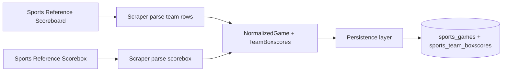
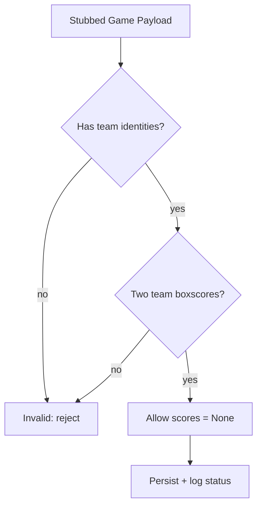
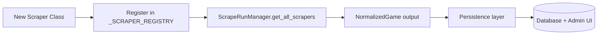

# Scoring Logic & Scraper Integration

## Purpose

This repository is the admin-side backbone for Scroll Down Sports. It:

- **Normalizes sports data** (scores, team stats, player stats, odds, social posts).
- **Persists a traceable audit trail** of scraper runs and ingested data.
- **Supports the admin UI and downstream apps** with consistent, predictable schemas.

## Score Logic Overview

Scores enter the system through the scraper normalization layer and persist into
`sports_games` along with team boxscores.

### Where scores come from

1. **Scoreboards (daily listings)**
   - For most leagues, scrapers parse scoreboards and extract numeric scores from
     the right-aligned score cell.
   - NCAA basketball has a scoreboard-specific fallback that scans cells from
     right-to-left to find a valid numeric score.
2. **Scoreboxes (single-game backfills)**
   - When backfilling an individual game, scrapers parse the game’s scorebox to
     get the home/away scores.

### How scores are stored

- `NormalizedGame.home_score` / `NormalizedGame.away_score`
- `NormalizedTeamBoxscore.points` for each team

These values are persisted into `sports_games` and `sports_team_boxscores`, which
power admin views and downstream consumption.

### Guardrails

- A **missing or non-numeric score** is treated as a parse error and logged.
- `NormalizedGame.team_boxscores` must include **two teams** (validator enforces
  non-empty team boxscores).
- League-specific quirks are handled in each scraper (e.g., NCAA basketball
  scoreboard parsing rules).

## Stubbed Data Expectations

When scrapers operate with incomplete data (pre-game, partial ingestion, or
placeholder runs), stub payloads should still satisfy the normalization and
persistence requirements.

**Minimum expectations for a stubbed game payload:**

- **Identity fields are always present**:
  - `GameIdentification.league_code`, `season`, `game_date`
  - `home_team` and `away_team` identities
- **Team boxscores are always present** (two entries):
  - `NormalizedTeamBoxscore.points` may be `None`
  - `raw_stats` can be empty
- **Scores may be absent**:
  - `NormalizedGame.home_score` / `away_score` may be `None`
- **Status must be explicit** when not completed (e.g., `scheduled`,
  `in_progress`, `postponed`) rather than relying on the default `completed`.

## How Future Scrapers Plug In

Scrapers are registered centrally and instantiated by the run manager.

### Integration steps

1. **Implement a scraper class**
   - Extend `BaseSportsReferenceScraper` or another base in
     `scraper/bets_scraper/scrapers/`.
   - Implement:
     - `fetch_games_for_date`
     - `pbp_url` (if play-by-play is supported)
     - `fetch_play_by_play` (if play-by-play is supported)
     - `fetch_single_boxscore` (for backfill support)

2. **Normalize output**
   - Build `NormalizedGame` objects with:
     - `GameIdentification` (team identities, season, date)
     - `home_score`, `away_score`
     - `team_boxscores` + `player_boxscores`

3. **Register the scraper**
   - Add it to `_SCRAPER_REGISTRY` in `scraper/bets_scraper/scrapers/__init__.py`.
   - Ensure the league code is supported by `IngestionConfig` and any season
     helpers.

4. **Run through the existing orchestrator**
   - `ScrapeRunManager` automatically pulls from `get_all_scrapers()` and
     coordinates persistence.

